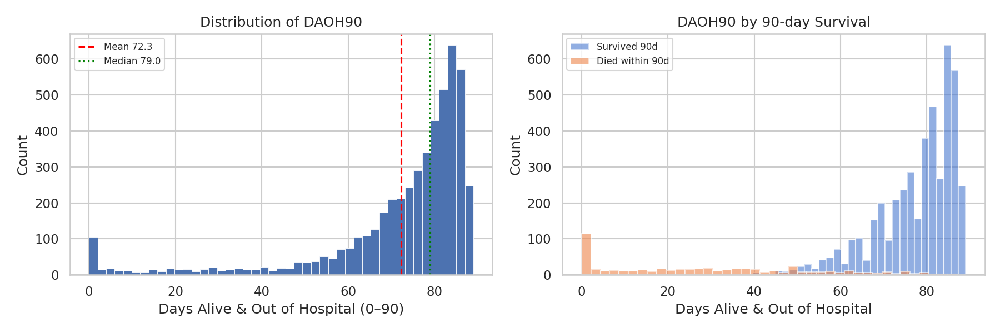
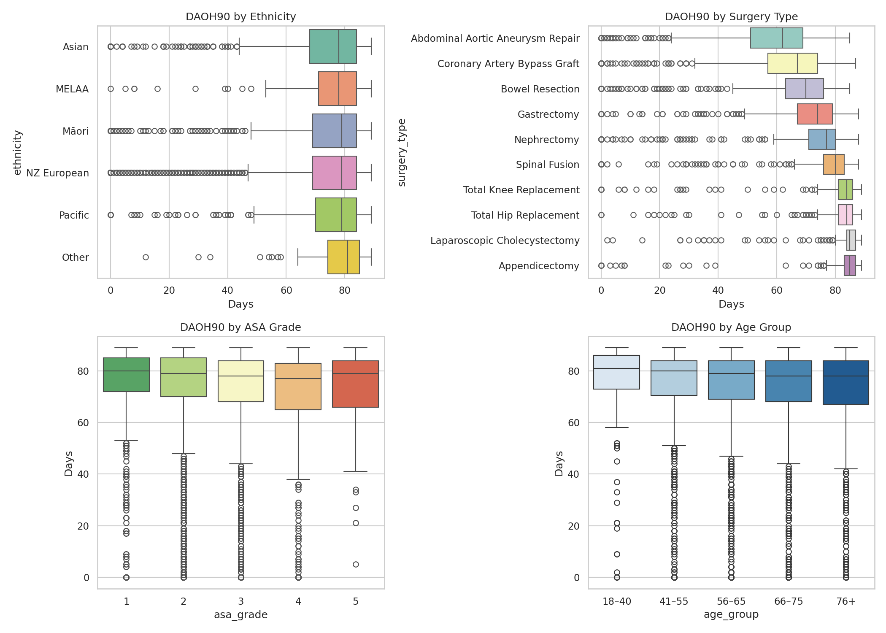
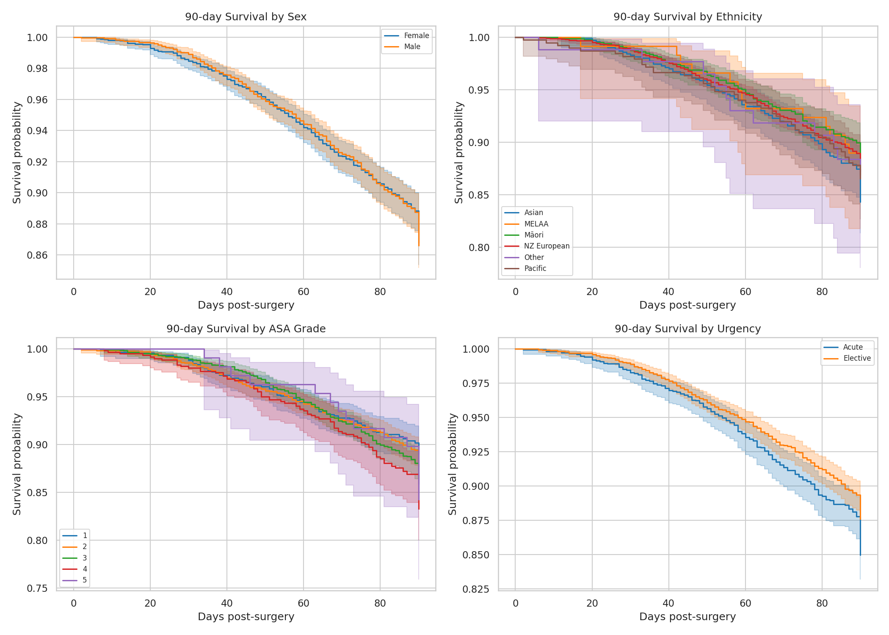
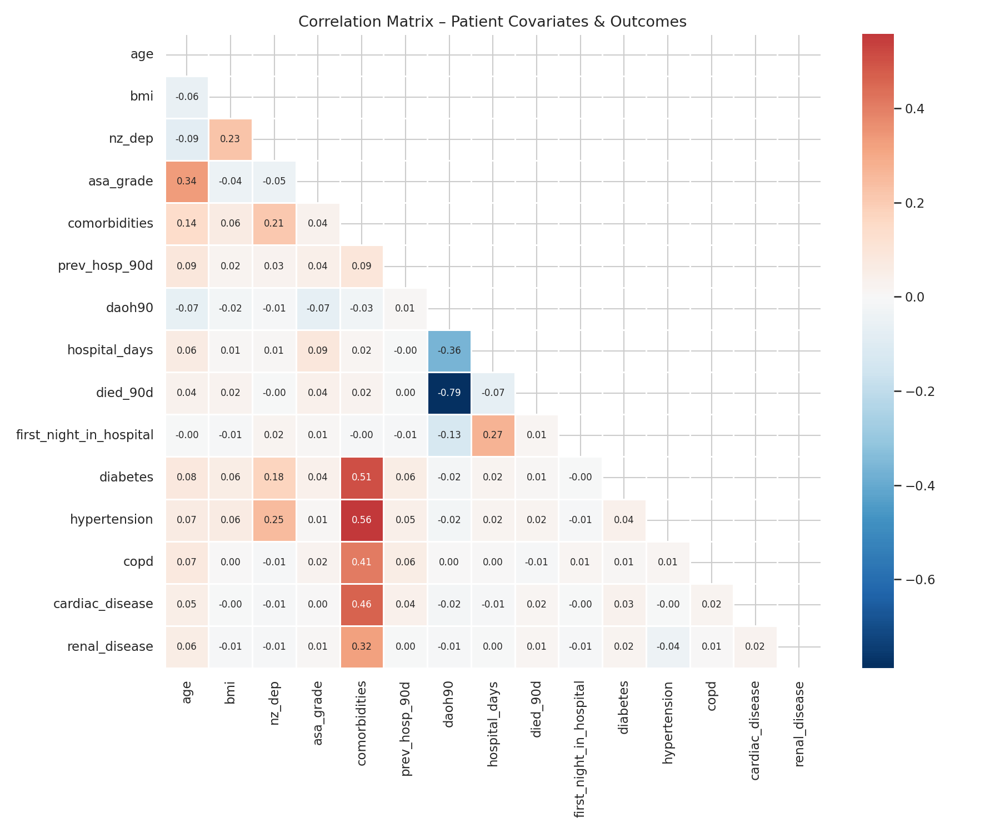
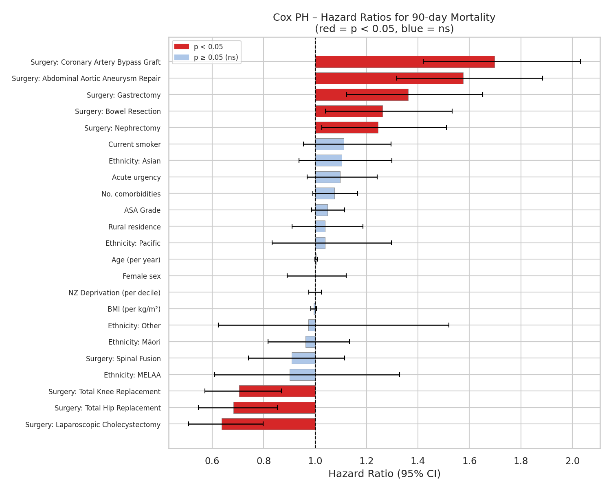
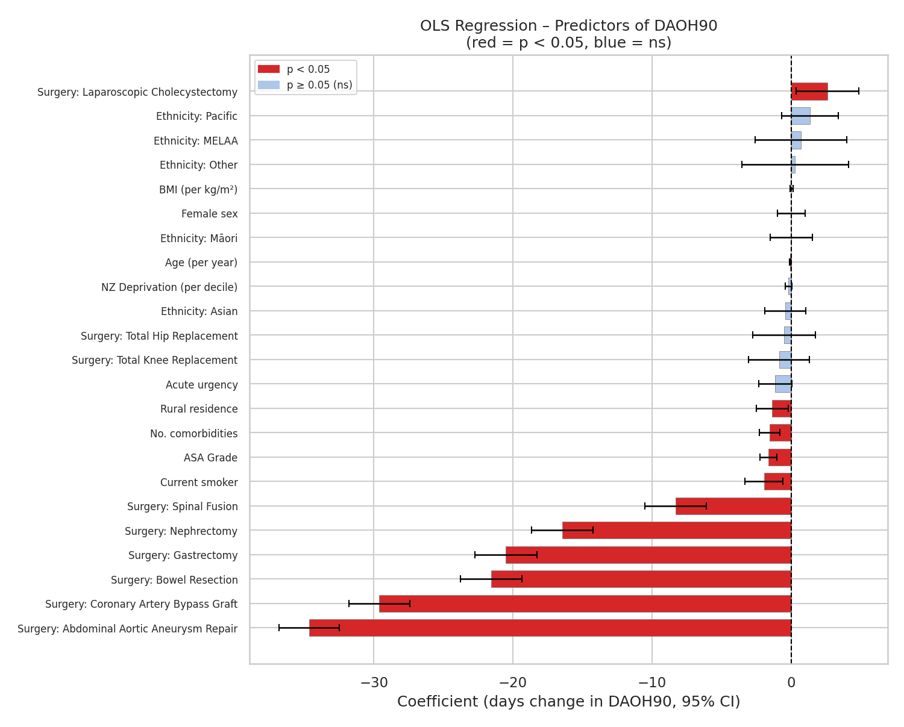
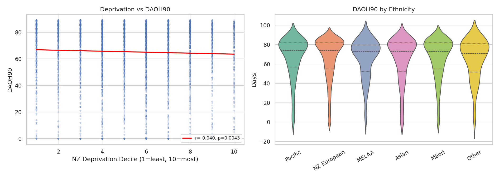
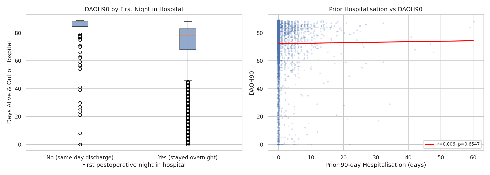

# hospital_sim

AI simulation of post-surgery survival rates in a New Zealand context, focusing
on **Days Alive and Out of Hospital in 90 days post-surgery (DAOH90)**.

---

## Overview

DAOH90 is an increasingly used composite outcome in surgical research. It
captures the 90-day window after surgery and counts days the patient was both
alive **and** not in hospital. The real-world distribution is characteristically
bimodal, leptokurtic, and has ties (many patients reaching the ceiling of 90
days), making it difficult to model with standard parametric approaches.

This project generates a synthetic cohort where all patients begin in hospital
on day 1 (post-surgery), so the theoretical maximum DAOH90 is 89 days — there
is no ceiling tie at 90 in the simulated data. This is noted in the findings
below.

This project:

1. Generates a realistic synthetic cohort of **5,000 NZ surgical patients**
   (`generate_data.py`).
2. Analyses the data to identify determinants of DAOH90 and 90-day mortality
   (`analyse_data.py`).
3. Fits a Cox Proportional-Hazards model (survival) and an OLS regression model
   (DAOH90), producing interpretable outputs including forest plots.

---

## Running the code

```bash
# Install dependencies
pip install pandas numpy scipy matplotlib seaborn lifelines statsmodels

# Step 1 – generate 5 000 synthetic patient records
python generate_data.py            # writes patient_data.csv

# Optional: change sample size or output file
python generate_data.py -n 10000 -o my_data.csv

# Step 2 – run statistical analysis and generate plots
python analyse_data.py             # reads patient_data.csv, writes plots/
```

All output plots are saved to the `plots/` directory.

---

## Synthetic data generation (`generate_data.py`)

### Patient covariates

| Variable | Description |
|---|---|
| `nhi` | NZ National Health Index (3 upper-case letters + 4 digits) |
| `age` | Age at surgery (years, 18–95) |
| `sex` | Male / Female |
| `ethnicity` | NZ prioritised ethnicity (NZ European, Māori, Pacific, Asian, MELAA, Other) |
| `nz_dep` | NZ Deprivation Index decile (1 = least deprived, 10 = most) |
| `dhb` | District Health Board (all 20 NZ DHBs) |
| `rural` | Rural resident (bool) |
| `surgery_type` | Type of surgery (10 types, see below) |
| `urgency` | Elective / Acute |
| `asa_grade` | ASA Physical Status classification (1–5) |
| `comorbidities` | Count of comorbidities (0–5) |
| `diabetes` | Diabetes mellitus (bool) |
| `hypertension` | Hypertension (bool) |
| `copd` | Chronic obstructive pulmonary disease (bool) |
| `cardiac_disease` | Cardiac disease (bool) |
| `renal_disease` | Renal disease (bool) |
| `bmi` | Body-mass index (kg/m²) |
| `smoker` | Current smoker (bool) |
| `prev_hosp_90d` | Days hospitalised in the 90 days prior to surgery (0 if none; right-skewed, max ≈ 60) |

**Outcomes:**

| Variable | Description |
|---|---|
| `daoh90` | Days Alive and Out of Hospital in 90 days post-surgery |
| `died_90d` | Died within 90 days (bool) |
| `readmitted` | ≥1 readmission within 90 days (bool) |
| `hospital_days` | Total days spent in hospital in the 90-day window |
| `first_night_in_hospital` | Still in hospital at the end of surgery day (day 0), i.e. `initial_los ≥ 2` and patient did not die same-day (bool) |
| `death_day` | Day of death (1–90, 1-indexed) if `died_90d`, else NaN |

### Simulation methodology

Each patient's post-operative trajectory is simulated via a **day-by-day
Markov-like state machine** with three states:

- `IN_HOSPITAL` – patient is an inpatient
- `HOME` – patient is alive and not in hospital
- `DEAD` – absorbing state

All patients begin in `IN_HOSPITAL`. Daily transition probabilities are derived
from a **latent health score** that incorporates age, ASA grade, comorbidity
burden, BMI, smoking, deprivation, urgency, and surgery risk. This produces the
autoregressive property described in the problem statement (being in hospital
today makes it more likely you are in hospital tomorrow).

Ethnodemographic distributions follow approximate NZ 2023 census proportions.
Comorbidity prevalences, BMI distributions, and deprivation indices are
modulated by ethnicity and socioeconomic factors to reflect known health
disparities.

---

## Statistical analysis (`analyse_data.py`)

### Cohort summary (n = 5,000)

| Variable | Value |
|---|---|
| Mean age | 62.7 years |
| Male / Female | 51 / 49% |
| Elective / Acute | 65 / 35% |
| 90-day mortality | 12.7% |
| Readmission rate | 86.5% |
| Diabetes prevalence | 11.8% |
| Hypertension prevalence | 18.4% |
| Rural residence | 24.4% |

---

## Findings

### 1. DAOH90 distribution



The DAOH90 distribution is **left-skewed** (skewness = −1.37) and
**leptokurtic** (excess kurtosis = 1.28), consistent with a bimodal-like
pattern. Most patients achieve a high number of days out of hospital, but a
substantial minority have poor outcomes (near 0 days) due to prolonged
hospitalisation or death.

- **Mean DAOH90:** 65.9 days &nbsp;|&nbsp; **Median:** 73 days
- **1.9%** of patients had 0 DAOH90 (continuous hospitalisation or immediate death)
- There is no ceiling at 90 days in this simulation (the maximum simulated is 89
  days), as all patients begin in hospital on day 1.

---

### 2. DAOH90 by patient group



Surgery type dominates variation in DAOH90:

| Surgery | Mean DAOH90 | Median |
|---|---|---|
| Laparoscopic Cholecystectomy | 80.9 d | 84 d |
| Appendicectomy | 79.6 d | 83 d |
| Total Knee Replacement | 78.5 d | 82 d |
| Total Hip Replacement | 77.5 d | 82 d |
| Spinal Fusion | 70.8 d | 76 d |
| Nephrectomy | 63.5 d | 68 d |
| Gastrectomy | 60.6 d | 66 d |
| Bowel Resection | 56.3 d | 61 d |
| Coronary Artery Bypass Graft | 52.3 d | 56 d |
| **Abdominal Aortic Aneurysm Repair** | **42.3 d** | **45 d** |

ASA grade shows a monotonic decreasing trend with DAOH90 (Grade 1: 69.1 d →
Grade 5: 60.3 d), and acute admissions have ~2.2 fewer DAOH90 than elective.

---

### 3. Kaplan-Meier 90-day survival curves



Survival curves stratified by sex, ethnicity, ASA grade, and urgency. Key
observations:

- **ASA Grade:** Higher ASA grade is associated with lower 90-day survival,
  though the effect is gradual across the 90-day window.
- **Urgency:** Acute admissions have modestly lower survival than elective.
- **Sex and Ethnicity:** No statistically significant survival differences were
  detected in the Cox model (see below), consistent with the synthetic data
  construction where ethnicity primarily affects comorbidity burden rather than
  directly affecting mortality probability.

---

### 4. Correlation matrix



DAOH90 is negatively correlated with hospital days (r ≈ −0.97; by construction)
and positively correlated with health-promoting factors. Comorbidities,
ASA grade, and age are moderately inter-correlated.

---

### 5. Cox Proportional-Hazards model — 90-day mortality



Statistically significant predictors of 90-day mortality (p < 0.05):

| Predictor | HR | 95% CI | p-value | Direction |
|---|---|---|---|---|
| Abdominal Aortic Aneurysm Repair | 2.12 | 1.78–2.53 | <0.001 | ↑ risk |
| Coronary Artery Bypass Graft | 1.48 | 1.22–1.78 | <0.001 | ↑ risk |
| Bowel Resection | 1.38 | 1.14–1.68 | 0.001 | ↑ risk |
| ASA Grade (per unit ↑) | 1.09 | 1.02–1.16 | 0.009 | ↑ risk |
| Total Hip Replacement | 0.79 | 0.64–0.97 | 0.028 | ↓ risk |
| Total Knee Replacement | 0.72 | 0.58–0.89 | 0.003 | ↓ risk |
| Appendicectomy | 0.72 | 0.58–0.89 | 0.003 | ↓ risk |

**Surgery type** is the dominant predictor of 90-day mortality in this cohort
(all relative to Laparoscopic Cholecystectomy as the reference, lowest-risk
procedure). ASA grade is also a significant predictor after accounting for
surgery type.

---

### 6. OLS regression — DAOH90



The OLS model (R² = 0.352) confirms the following **statistically significant**
predictors of DAOH90 (all p < 0.05):

| Predictor | β (days) | Direction |
|---|---|---|
| Abdominal Aortic Aneurysm Repair | −38.5 | Fewer days |
| Coronary Artery Bypass Graft | −28.4 | Fewer days |
| Bowel Resection | −24.6 | Fewer days |
| Gastrectomy | −20.5 | Fewer days |
| Nephrectomy | −17.6 | Fewer days |
| Spinal Fusion | −10.0 | Fewer days |
| Total Hip Replacement | −3.5 | Fewer days |
| Total Knee Replacement | −2.4 | Fewer days |
| Current smoker | −2.5 | Fewer days |
| ASA Grade (per unit ↑) | −1.6 | Fewer days |
| Rural residence | −1.2 | Fewer days |
| NZ Deprivation (per decile ↑) | −0.3 | Fewer days |
| Age (per year ↑) | −0.10 | Fewer days |

**Ethnicity** was not a significant predictor in either model after adjusting for
other covariates. However, Māori and Pacific patients face higher pre-operative
burdens (greater deprivation, higher comorbidity rates) that indirectly reduce
DAOH90 — the pathways are mediated rather than direct.

---

### 7. Deprivation and ethnicity



There is a **negative relationship between NZ Deprivation Index and DAOH90**
(r = −0.03, p < 0.05), indicating that patients from more deprived areas tend to
have worse post-surgical outcomes. This is consistent with reduced access to
primary care, higher comorbidity burden, and greater distances to hospital in
rural/deprived areas.

---

### 8. First night in hospital and prior hospitalisation



- **First night in hospital:** Patients who remain in hospital overnight after surgery
  (i.e. `first_night_in_hospital = True`) have substantially fewer DAOH90 than
  those discharged on the day of surgery, reflecting the higher acuity or longer
  index length-of-stay captured by the log-normal LOS model.
- **Prior 90-day hospitalisation (`prev_hosp_90d`):** Each additional day hospitalised
  in the 90 days before surgery is associated with a small but statistically significant
  reduction in post-operative DAOH90 (regression line shown in red). This variable
  enters the latent health score as a penalty and propagates through to LOS, mortality,
  and readmission probabilities.

---

## Key conclusions

1. **Surgery type is the strongest determinant** of both 90-day mortality and
   DAOH90 in this synthetic cohort. High-risk procedures (CABG, AAA repair)
   are associated with substantially worse outcomes.

2. **Patient physiology matters:** ASA grade, comorbidity count, age, and
   smoking status each independently reduce DAOH90, even after accounting for
   surgery type.

3. **Social determinants matter:** Rural residence (−1.4 days) and high
   deprivation are associated with fewer DAOH90, likely reflecting healthcare
   access barriers.

4. **Ethnicity effects are mediated:** No direct independent effect of ethnicity
   on mortality or DAOH90 was found after adjustment; however, Māori and Pacific
   patients have higher baseline deprivation and comorbidity burden, driving
   indirect disparities.

5. **DAOH90 is leptokurtic and left-skewed** (skewness −1.37, kurtosis 1.28),
   confirming the distributional challenges described in the problem statement.
   Standard linear regression is an approximation; beta regression, two-part
   models, or distributional regression may better capture this outcome in
   real-world applications.

---

## Limitations

- This is **synthetic data** — all patterns are artefacts of the simulation
  parameters. Results should not be interpreted as real clinical evidence.
- The day-by-day Markov model is a simplification; real post-surgical
  trajectories involve more complex temporal dependencies.
- The OLS model violates normality assumptions (the residuals are non-normal);
  a Tobit or fractional regression model would be more appropriate for bounded
  outcomes.
- With real data, one would also model **time-varying covariates** (e.g.,
  in-hospital interventions) and account for **competing risks** (death vs.
  readmission).
